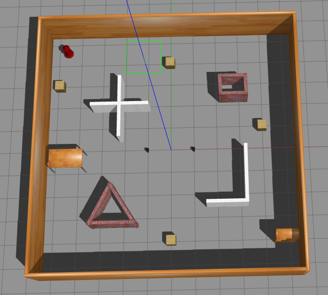
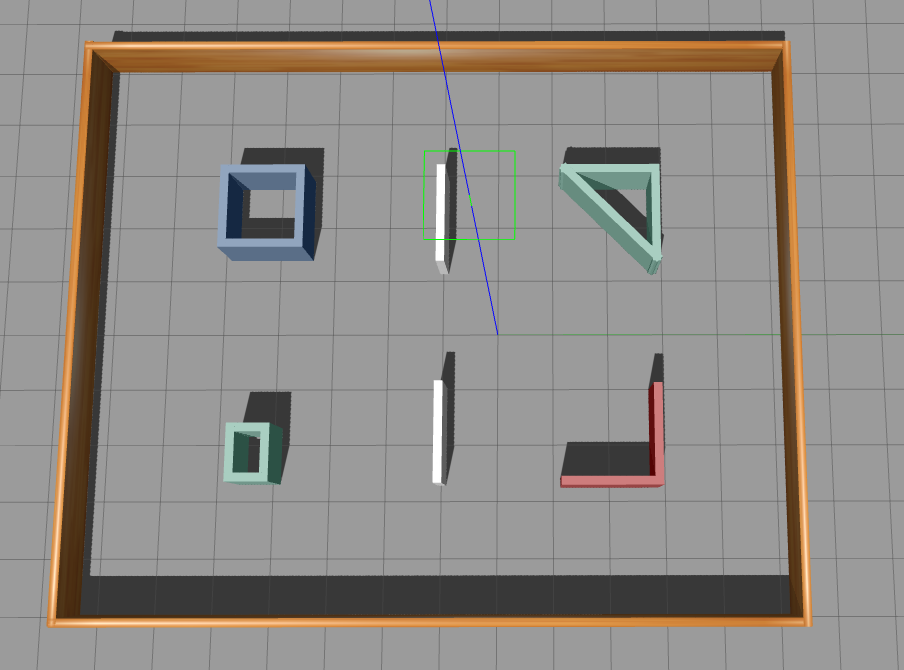
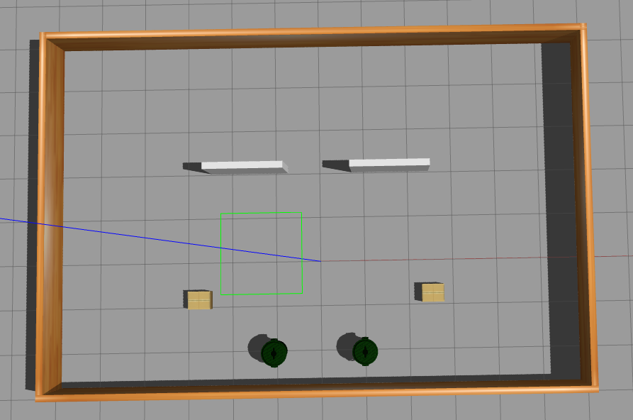
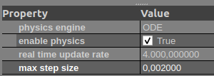

# Obstacle Avoidance with Multi-Agent TD3 (MATD3)

This repository implements a multi-agent reinforcement learning framework for obstacle avoidance in robotic environments using the Multi-Agent Twin Delayed Deep Deterministic Policy Gradient (MATD3) algorithm. The system is designed to work with ROS and Gazebo for realistic robot simulation.

## Features

- **Multi-Agent TD3 Algorithm:** Robust training for multiple agents in continuous action spaces.
- **Gazebo Integration:** Realistic simulation of robots and obstacles.
- **Replay Buffer:** Efficient experience storage and sampling.
- **Training & Testing Scripts:** Modular scripts for training agents and evaluating performance.
- **Reward Logging:** Automated export of reward logs for analysis.

<p align="center">
  
</p>


## Setup

Clone this repository into your workspace:
```bash
cd ~/catkin_ws/src
git clone https://github.com/optimistprime21/obstacle-avoidance-matd3.git
cd ~/catkin_ws
catkin build
```

## **Training**

1. **Modify training script**

   Open `train_matd3.py` and update the environment path to match your system:

   ```python
   self.env = GazeboEnv(".../launch/two_robots.launch", self.environment_dim)
   ```

2. **Start training**

   Run the training script:

   ```bash
   python train_matd3.py
   ```

3. **Monitor training progress**

   Navigate to the `runs/` folder and launch TensorBoard:

   ```bash
   cd runs
   tensorboard --logdir MATD3
   ```

   Then open the URL shown in the terminal (usually http://localhost:6006) in your browser.

4. **Stop training**

   To cleanly stop training and terminate all related ROS/Gazebo processes, run:

   ```bash
   killall -9 rosout roslaunch rosmaster gzserver nodelet robot_state_publisher gzclient python python3 .rviz
   ```


## Testing

There are **two test environments** available:

* **`ComplexEnv`** → larger area with more complex shapes.
* **`GateEnv`** → includes a gate that robots must pass through to reach their goals.

 

### 1. Choose the test environment

Open `test.py` and modify the following lines according to your choice:

```python
from test_envs import ComplexEnv   # or GateEnv
env = ComplexEnv(".../obstacle-avoidance-matd3/launch/test_scenario.launch", environment_dim)
```

### 2. Select the world file

Inside `test.launch`, update the world file path to match your chosen environment:

```xml
<arg name="world_name" value="$(find obstacle-avoidance-matd3)/worlds/complex.world"/>
```

(Replace `complex.world` with another world file if needed.)

### 3. Load the trained model

Pick the model you want to test and update the path in `test.py`:

```python
step = 350
model_path = f".../models/MATD3_actor_number_1_step_{step}k_agent_{agent_id}.pth"
env = ComplexEnv(".../obstacle-avoidance-matd3/launch/test_scenario.launch", environment_dim)
```

Adjust the `step` and `model_path` values according to your saved models.

### 4. Run the test

Finally, run:

```bash
python test.py
```

## Note:
If you want to make the training and testing process faster, you can adjust the Real Time Update Rate and Max Step Size under Physics Properties in Gazebo (see the image below).
However, if you do this, you must also update the TIME_DELTA value in the code.
For example, if you apply the settings shown in the image, you should write TIME_DELTA / 8 instead of the default TIME_DELTA.





## Citation

This codebase adapts the single-agent TD3 implementation from:

> Reinis Cimurs, Il Hong Suh, Jin Han Lee,  
> "Goal-Driven Autonomous Exploration Through Deep Reinforcement Learning,"  
> IEEE Robotics and Automation Letters, vol. 7, no. 2, pp. 730-737, 2022.  
> [DOI: 10.1109/LRA.2021.3133591](https://doi.org/10.1109/LRA.2021.3133591)


